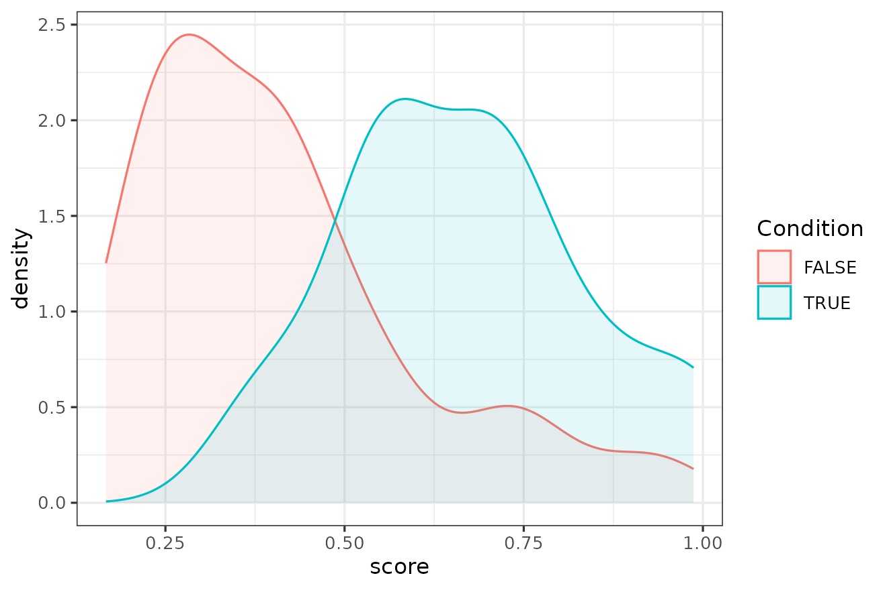

# idiolect

``` r
library(idiolect)
#> Loading required package: quanteda
#> Package version: 4.3.1
#> Unicode version: 15.1
#> ICU version: 74.2
#> Parallel computing: disabled
#> See https://quanteda.io for tutorials and examples.
```

`idiolect` is a package that depends on `quanteda` for all the main
Natural Language Processing functions. Although the basic object types
and functions are described in detail in the documentation of this
package, familiarity with `quanteda` is highly recommended. More
information about `quanteda` can be found on its
[website](http://quanteda.io).

## Introduction

Authorship Analysis is defined as the task of determining the likelihood
that a certain candidate is the author of a certain set of questioned or
disputed texts. We call *Forensic* Authorship Analysis a task of this
kind applied in a real forensic case. In such settings, the disputed
texts could be anonymous malicious documents, such as a threatening
letter, but could also be text messages, emails, or any other document
that, for various reasons, becomes evidence in a forensic case. In
Forensic Linguistics, typically a set of disputed or *questioned* text
is indicated as $Q$, while a set of texts of known origin, for example
the texts written by the candidate author and collected as comparison
material, is labelled using $K$. In addition to these two datasets, the
analysis also necessitates of a comparison reference corpus that we call
$R$. In a classic case involving a closed set of suspects, the texts
written by the suspects minus the candidate form $R$. In *Authorship
Verification* cases that only involve one candidate author, then the
reference dataset might have to be compiled by the analyst for the
specific case (Ishihara et al. 2024).

A crucial difference between Authorship Analysis and Forensic Authorship
Analysis is that whereas the former can be treated as a classification
task where the final answer is binary (‘candidate is the author’
vs. ‘candidate is NOT the author’), the latter needs an expression of
likelihood for the two competing propositions or hypotheses, the
Prosecution Hypothesis $H_{p}$ vs. the Defence Hypothesis $H_{d}$, for
example:

$H_{p}$:The author of$K$and the author of$Q$are the same individual.  
$H_{d}$:The author of$K$and the author of$Q$are two different
individuals.

The job of the forensic linguist in a forensic context is to analyse the
linguistic evidence and determine which hypothesis it supports and with
what degree of strength, thus aiding the trier-of-fact in reaching a
conclusion. The role of the forensic linguist is therefore not to
provide a YES/NO answer but rather to express the strength of the
evidence in favour of each of these two hypotheses.

Given $K$, $Q$ and $R$, the workflow for this analysis involves four
steps:

1.  **Preparation**: This step involves any pre-processing step that is
    necessary for the analysis with the chosen method;
2.  **Validation**: Carry out an analysis on the case data or on a
    separate dataset that has been designed to be similar to the case
    material in order to validate the method for this particular case;
3.  **Analysis**: Carry out the analysis on the real $K$, $Q$, and $R$;
4.  **Calibration**: Turn the output of (3) into a Likelihood Ratio that
    expresses the strength of the evidence given the two competing
    hypotheses.

## Preparation

`idiolect` has a function to import texts into `R` called
[`create_corpus()`](https://andreanini.github.io/idiolect/reference/create_corpus.md).
This function is simply calling `readtext` (therefore this package must
be installed) while scanning the name of the files for the metadata of
each text, specifically the name of the author and the name of the file.
The syntax to follow to name the files is

authorname_textname.txt(e.g. smith_text1.txt).

Assuming that a folder of plain text files with names according to this
syntax are ready on the user’s computer, then the following command (not
executed here) loads the folder as a `quanteda` corpus object with the
metadata as `docvars`.

``` r
corpus <- create_corpus("path/to/folder")
```

In this vignette, instead, the workflow is demonstrated using a small
dataset of the Enron corpus that is included in this package (see
[`?enron.sample`](https://andreanini.github.io/idiolect/reference/enron.sample.md)).

``` r
corpus <- enron.sample
```

This corpus is a `quanteda` corpus object that contains ten authors with
approximately the same amount of data.

### Content masking

A highly recommended and sometimes necessary pre-processing step is
content masking. This step consists in masking or removing words or
other tokens in the text that are likely to create noise for an
authorship analysis. Hiding content not only avoids incorrectly
attributing a text based on the correlation between topics and authors
(Bischoff et al. 2020) but also tends to improve the performance of
authorship analysis methods in cross-topic and cross-genre situations
(Stamatatos 2017).

Three content masking methods are implemented in `idiolect`: (1) the
*POSnoise* algorithm developed by Halvani and Graner (2021); (2) the
*frame n-grams* approach introduced by Nini (2023); and (3) an
implementation of the *TextDistortion* approach originally introduced by
Stamatatos (2017). These options are available in the
[`contentmask()`](https://andreanini.github.io/idiolect/reference/contentmask.md)
function. Because this function depends on
[`spacyr`](https://spacyr.quanteda.io/reference/spacyr-package.html) and
this requires downloading a parsing model for a language for the
automatic tagging of Parts of Speech (e.g. nouns, adjectives, adverbs),
this function is not run in this vignette. Instead, the Enron sample has
already been content-masked using *POSnoise*, as can be seen from the
preview of the corpus

``` r
corpus
#> Corpus consisting of 49 documents and 1 docvar.
#> known [Kh Mail_1].txt :
#> "N N N N wants to be N when he V up likes N P , N for doing t..."
#> 
#> known [Kh Mail_3].txt :
#> "i 've V a J one , but the only N N N i have is on a N N from..."
#> 
#> known [Kh Mail_4].txt :
#> "this was J towards the N of a J N N N . in N , P P helped th..."
#> 
#> known [Kh Mail_5].txt :
#> "V the N for more than D N may get you V . a N N with a N and..."
#> 
#> unknown [Kh Mail_2].txt :
#> "P , here 's the J N on our P P N V to V the V needs of the P..."
#> 
#> unknown [Kw Mail_3].txt :
#> "they also have J N at the J N of P D per N and only a D J ea..."
#> 
#> [ reached max_ndoc ... 43 more documents ]
```

The *POSnoise* algorithm essentially replaces all words that tend to
contain meaning (nouns, verbs, adjectives, adverbs) with their Part of
Speech tag (N, V, J, B) while all the other words or tokens are left
unchanged. In addition to this operation, *POSnoise* contains a white
list of content words that mostly tend to be functional in English, such
as verbs like *do, have, make* or adverbs such as *consequently*,
*therefore*.

The following code should be used to run the
[`contentmask()`](https://andreanini.github.io/idiolect/reference/contentmask.md)
function. This will require installing and initiating a
[*spacy*](https://spacy.io) parsing model for the language chosen. This
process should happen automatically

``` r
posnoised.corpus <- contentmask(corpus, model = "en_core_web_sm", algorithm = "POSnoise")
```

### Data labelling

In this example it is simulated that the first text written by the
author *Kw* is the real $Q$ text (the one labelled as ‘unknown’) and all
the other known texts written by *Kw* (labelled as ‘known’) are
therefore the set of known texts $K$. The remaining texts from the other
authors are the reference samples $R$.

``` r
Q <- corpus_subset(corpus, author == "Kw")[1]
K <- corpus_subset(corpus, author == "Kw")[2:5]
R <- corpus_subset(corpus, author != "Kw")
```

### Vectorisation

Before applying certain authorship analysis methods, each text or sample
must be turned into a numerical representation called a *feature
vector*, a process typically referred to as *vectorisation*. `idiolect`
has a function to vectorise a corpus called
[`vectorize()`](https://andreanini.github.io/idiolect/reference/vectorize.md).
The features normally used by many authorship analysis methods are
$n$-grams of words and punctuation marks or characters. For example, the
$Q$ text can be vectorised into the relative frequencies of its words
using this code.

``` r
vectorize(Q, tokens = "word", remove_punct = F, remove_symbols = T, remove_numbers = T,
          lowercase = T, n = 1, weighting = "rel", trim = F) |> 
  print(max_nfeat = 3)
#> Document-feature matrix of: 1 document, 136 features (0.00% sparse) and 1 docvar.
#>                          features
#> docs                            they        also      have
#>   unknown [Kw Mail_3].txt 0.00289296 0.009643202 0.0192864
#> [ reached max_nfeat ... 133 more features ]
```

or, as the most frequent 1,000 character 4-grams relative frequencies,
for example, using

``` r
vectorize(Q, tokens = "character", remove_punct = F, remove_symbols = T, remove_numbers = T,
          lowercase = T, n = 4, weighting = "rel", trim = T, threshold = 1000) |> 
  print(max_nfeat = 3)
#> Document-feature matrix of: 1 document, 1,094 features (0.00% sparse) and 1 docvar.
#>                          features
#> docs                              they         hey          ey a
#>   unknown [Kw Mail_3].txt 0.0009771987 0.0009771987 0.0003257329
#> [ reached max_nfeat ... 1,091 more features ]
```

The output of the function is a `quanteda` *document-feature matrix* (or
*dfm*) that can efficiently store even very large matrices.

This
[`vectorize()`](https://andreanini.github.io/idiolect/reference/vectorize.md)
function is mostly designed for expert users because different choices
in the parameters of the vectorisation can be made using each single
authorship analysis method function. In addition, since most authorship
analysis methods already have a default setting of these parameters,
these are already the default for the authorship analysis functions.

This step is therefore not necessary unless there are specific
requirements as any vectorisation is handled by the functions that apply
the authorship analysis methods.

## Validation

The first step of the validation is to remove the real $Q$ text. This is
the actual forensic sample to analyse and it must be therefore removed
when validating the analysis. The validation set is therefore made up of
only the $K$ and $R$ datasets

``` r
validation <- K + R
```

This dataset can now be re-divided into ‘fake’ $Q$ texts and ‘fake’ $K$
texts. Each text in this corpus is labelled as ‘unknown’ or ‘known’ so
two new disjoint datasets, `validation.Q` and `validation.K` can be
created by selecting the texts based on this label.

``` r
validation.Q <- corpus_subset(validation, grepl("^unknown", docnames(validation)))
validation.K <- corpus_subset(validation, grepl("^known", docnames(validation)))
```

This is not the only way in which a validation analysis can be
conducted. For example, one could adopt a leave-one-out approach by
taking each single text and treat it as a $Q$ and then run an authorship
analysis method for each one of them. Alternatively, a completely
different dataset that is similar to the case data could be used. This
simpler approach is more suitable for this small example.

### Authorship analysis

The analysis that is being validated is the same analysis that will be
applied to the $Q$ text. Therefore, a choice of method has to be made
depending on the right choice to analyse $Q$. In this example, the
scenario simulated is a *verification*: was the unknown $Q$ text written
by the $K$ author, *Kw*? For this reason, the method chosen is one of
the most successful authorship verification methods available today, the
*Impostors Method* (Koppel and Winter 2014), and in particular one of
its latest variants called the *Rank-Based Impostors Method* (Potha and
Stamatatos 2017, 2020).

This analysis can be run in `idiolect` using the function
[`impostors()`](https://andreanini.github.io/idiolect/reference/impostors.md)
and then selecting the default parameter for the *algorithm* argument,
“*RBI*”. The main argument of this function are the *q.data*, which is
the set of $Q$ texts to test, and the *k.data*, which is the set of $K$
texts from one or more authors that are going to be tested, and finally
the set of impostors data, *cand.imps*. For this example, the impostors
data is $R$ set but generally the recommendation is to use another
dataset when possible.

The
[`impostors()`](https://andreanini.github.io/idiolect/reference/impostors.md)
function accepts more than one author in *k.data* and it also accepts
the same dataset as input for both *k.data* and *cand.imps*. When the
same dataset is used,
[`impostors()`](https://andreanini.github.io/idiolect/reference/impostors.md)
will test each author in *k.data* and use the texts written by other
authors as impostors.

In contrast to other authorship analysis functions like
[`delta()`](https://andreanini.github.io/idiolect/reference/delta.md)
and
[`ngram_tracing()`](https://andreanini.github.io/idiolect/reference/ngram_tracing.md),
[`impostors()`](https://andreanini.github.io/idiolect/reference/impostors.md)
does not offer additional parameters to modify the vectorisation process
because all the Impostors Method algorithms already have a
well-specified default setting. If the user wants to change that they
should then vectorise the corpus separately using
[`vectorize()`](https://andreanini.github.io/idiolect/reference/vectorize.md)
and then use the *dfm* as the input of
[`impostors()`](https://andreanini.github.io/idiolect/reference/impostors.md).

The RBI variant of the method also requires setting a parameter called
$k$, which is the number of most similar impostors texts to sample from
the wider set of impostors. The recommended setting is $k = 100$ or
$k = 300$ but for simplicity this is set to $k = 50$ in this example.

Because an analysis using the Impostors Method can have long run times,
this function can also be parallelised using more than one core.

``` r
res <- impostors(validation.Q, validation.K, validation.K, algorithm = "RBI", k = 50)
```

The output of
[`impostors()`](https://andreanini.github.io/idiolect/reference/impostors.md)
is a data frame showing the results of comparing each $K$ author with
each $Q$ text. The variable *target* is TRUE if the comparison is a
same-author one or FALSE if it is a different-author one. The variable
*score* contains the Impostors score, which is a value that ranges from
0 to 1. Other authorship analysis functions return the same data frame
type with the same columns. The variable *score* therefore represents
different quantities depending on the analysis function used (e.g. for
[`delta()`](https://andreanini.github.io/idiolect/reference/delta.md),
this is the $\Delta$ coefficient, and so on).

``` r
res[1:10,]
#>     K                       Q target score
#> 1  Kw unknown [Kh Mail_2].txt  FALSE 0.404
#> 2  Kw unknown [Lc Mail_1].txt  FALSE 0.243
#> 3  Kw unknown [Ld Mail_4].txt  FALSE 0.752
#> 4  Kw unknown [Lt Mail_2].txt  FALSE 0.215
#> 5  Kw unknown [Lk Mail_4].txt  FALSE 0.306
#> 6  Kw unknown [Lb Mail_3].txt  FALSE 0.975
#> 7  Kw unknown [La Mail_3].txt  FALSE 0.262
#> 8  Kw unknown [Mf Mail_1].txt  FALSE 0.933
#> 9  Kw unknown [Ml Mail_3].txt  FALSE 0.846
#> 10 Kh unknown [Kh Mail_2].txt   TRUE 0.555
```

In order to assess the results of this validation analysis, the function
[`performance()`](https://andreanini.github.io/idiolect/reference/performance.md)
can be used to return a series of performance metrics. This function can
take one or two result data frames as input. If two are provided, then
one is used as training and the other one as test. If only one data
frame is provided, then the performance metrics are calculated using a
leave-one-out approach.

The procedure followed by this function is to held out one text (if
leave-one-out, otherwise the test dataset in its entirety) and then use
the rest of the data (or the training dataset) as a calibration dataset
to calculate a *Log-Likelihood Ratio* ($LLR$). This analysis is done
using the
[`calibrate_LLR()`](https://andreanini.github.io/idiolect/reference/calibrate_LLR.md)
function, which fits a logistic regression model to calibrate the score
into a $LLR$Ishihara (2021) using the `ROC` library (Leeuwen 2015).

The output of the function is the following

``` r
p <- performance(res)
#>   |                                                                              |                                                                      |   0%  |                                                                              |=                                                                     |   1%  |                                                                              |==                                                                    |   2%  |                                                                              |==                                                                    |   3%  |                                                                              |===                                                                   |   4%  |                                                                              |====                                                                  |   6%  |                                                                              |=====                                                                 |   7%  |                                                                              |======                                                                |   8%  |                                                                              |======                                                                |   9%  |                                                                              |=======                                                               |  10%  |                                                                              |========                                                              |  11%  |                                                                              |=========                                                             |  12%  |                                                                              |=========                                                             |  13%  |                                                                              |==========                                                            |  15%  |                                                                              |===========                                                           |  16%  |                                                                              |============                                                          |  17%  |                                                                              |=============                                                         |  18%  |                                                                              |=============                                                         |  19%  |                                                                              |==============                                                        |  20%  |                                                                              |===============                                                       |  21%  |                                                                              |================                                                      |  22%  |                                                                              |=================                                                     |  24%  |                                                                              |=================                                                     |  25%  |                                                                              |==================                                                    |  26%  |                                                                              |===================                                                   |  27%  |                                                                              |====================                                                  |  28%  |                                                                              |====================                                                  |  29%  |                                                                              |=====================                                                 |  30%  |                                                                              |======================                                                |  31%  |                                                                              |=======================                                               |  33%  |                                                                              |========================                                              |  34%  |                                                                              |========================                                              |  35%  |                                                                              |=========================                                             |  36%  |                                                                              |==========================                                            |  37%  |                                                                              |===========================                                           |  38%  |                                                                              |============================                                          |  39%  |                                                                              |============================                                          |  40%  |                                                                              |=============================                                         |  42%  |                                                                              |==============================                                        |  43%  |                                                                              |===============================                                       |  44%  |                                                                              |===============================                                       |  45%  |                                                                              |================================                                      |  46%  |                                                                              |=================================                                     |  47%  |                                                                              |==================================                                    |  48%  |                                                                              |===================================                                   |  49%  |                                                                              |===================================                                   |  51%  |                                                                              |====================================                                  |  52%  |                                                                              |=====================================                                 |  53%  |                                                                              |======================================                                |  54%  |                                                                              |=======================================                               |  55%  |                                                                              |=======================================                               |  56%  |                                                                              |========================================                              |  57%  |                                                                              |=========================================                             |  58%  |                                                                              |==========================================                            |  60%  |                                                                              |==========================================                            |  61%  |                                                                              |===========================================                           |  62%  |                                                                              |============================================                          |  63%  |                                                                              |=============================================                         |  64%  |                                                                              |==============================================                        |  65%  |                                                                              |==============================================                        |  66%  |                                                                              |===============================================                       |  67%  |                                                                              |================================================                      |  69%  |                                                                              |=================================================                     |  70%  |                                                                              |==================================================                    |  71%  |                                                                              |==================================================                    |  72%  |                                                                              |===================================================                   |  73%  |                                                                              |====================================================                  |  74%  |                                                                              |=====================================================                 |  75%  |                                                                              |=====================================================                 |  76%  |                                                                              |======================================================                |  78%  |                                                                              |=======================================================               |  79%  |                                                                              |========================================================              |  80%  |                                                                              |=========================================================             |  81%  |                                                                              |=========================================================             |  82%  |                                                                              |==========================================================            |  83%  |                                                                              |===========================================================           |  84%  |                                                                              |============================================================          |  85%  |                                                                              |=============================================================         |  87%  |                                                                              |=============================================================         |  88%  |                                                                              |==============================================================        |  89%  |                                                                              |===============================================================       |  90%  |                                                                              |================================================================      |  91%  |                                                                              |================================================================      |  92%  |                                                                              |=================================================================     |  93%  |                                                                              |==================================================================    |  94%  |                                                                              |===================================================================   |  96%  |                                                                              |====================================================================  |  97%  |                                                                              |====================================================================  |  98%  |                                                                              |===================================================================== |  99%  |                                                                              |======================================================================| 100%
p$evaluation
#>        Cllr  Cllr_min      EER Mean TRUE LLR Mean FALSE LLR TRUE trials
#> 1 0.8043863 0.6155326 19.04762      0.413398     -0.3864078          11
#>   FALSE trials      AUC Balanced Accuracy Precision    Recall        F1 TP FN
#> 1           83 0.829904          0.845679 0.3333333 0.8888889 0.4848485  8  1
#>   FP TN
#> 1 16 65
```

The $C_{llr}$ and $C_{llr}^{min}$ coefficients are used to evaluate the
performance of the $LLR$(Ramos et al. 2013). These coefficients estimate
the cost of the $LLR$, where a value of 1 indicates no information in
the $LLR$ and a lower coefficient $C_{llr} < 1$ suggests that there is
information in the $LLR$, with lower values of $C_{llr}$ suggesting
better performance. The other binary classification metrics returned,
such as Precision, Recall, and F1, are all calculated using $LLR > 0$ as
the threshold for a TRUE (or same-author in this case) classification.

In the present example, a $C_{llr} =$ 0.804 suggests that there is
enough information in the $LLR$ to be able to proceed with the actual
forensic analysis. The $C_{llr}^{min}$, which is the component of
$C_{llr}$ measuring the amount of discrimination, is even lower, which
means that there is a substantial difference in the two distributions.
This is confirmed by the Area Under the Curve value of 0.83. Because of
the large disparity between the TRUE and FALSE test cases, the values of
Precision and F1 are misleading. The Balanced Accuracy value of 0.846,
however, again suggests a substantial amount of discrimination at
$LLR = 0$.

The results of the analysis can also be plotted using a density plot for
each of the two distributions, TRUE and FALSE. This can be done using
the
[`density_plot()`](https://andreanini.github.io/idiolect/reference/density_plot.md)
function

``` r
density_plot(res)
```



This plot shows the values of the score on the horizontal axis and the
density for TRUE (red) vs. FALSE (blue) on the vertical axis.

These findings are evidence that the method is validated for this
dataset and it is now possible to analyse the $Q$ text and use these
results to calibrate the $LLR$ for $Q$.

## Analysis of $Q$

At this point the only thing left to do is to analyse the forensic data
by feeding the real $Q$, $K$, and $R$ into the
[`impostors()`](https://andreanini.github.io/idiolect/reference/impostors.md)
function using the same settings used for the validation.

``` r
q.res <- impostors(Q, K, R, algorithm = "RBI", k = 50)
```

Because there is only one $Q$ text, the final table of results only
contains one row

``` r
q.res
#>    K                       Q target score
#> 1 Kw unknown [Kw Mail_3].txt   TRUE 0.975
```

### Qualitative examination of evidence

Before reaching the conclusions, it is often important to inspect the
features that the algorithm has considered for the analysis. In a
forensic analysis, good knowledge of the data is important and best
practice require the analyst to be very familiar with the dataset before
running a computational analysis. Reading the data and being familiar
with it can lead to the addition of more pre-processing steps to remove
noise and can help the analyst spot any problem mistakenly introduced by
the algorithm.

In addition to familiarise themselves with the data, `idiolect` allows
the analyst to explore the most important feature considered by the
authorship analysis method used. For example, when using the RBI
algorithm with
[`impostors()`](https://andreanini.github.io/idiolect/reference/impostors.md)
then the parameter *features* can be switched to TRUE to obtain a list
of important features. Running this again with this parameter switched
on produces the following results

``` r
q.res2 <- impostors(Q, K, R, algorithm = "RBI", k = 50, features = T)
strwrap(q.res2$features, width = 70)
#>  [1] ", her|lso ,|so , |P P f|, i w|N N .| too |our P|ur P |also |re is|i"  
#>  [2] "jus|ll me|l me |ere i|st wa|P , h|u hav| yet | , he|ou ha|ust w|you"  
#>  [3] "h| also|rom P|om P |ve no|u and|he J |N N N|the J|V our| here|ve a"   
#>  [4] "|ith y|re al|few N|ew N | so i|ou an|e a N|P P i|P on |th yo| V my|V" 
#>  [5] "my |e N w| , so|me to| few |eithe|ither| him |V it | P on|out w|at i" 
#>  [6] "|t kno| may |P P V| N fr|u to |N fro|e is |V wit| V it|P for|, i h|"  
#>  [7] "is o|u nee|ou to| V wi|s for| P fo|a N a|do no|h you| P in|P in | B ,"
#>  [8] "| J N | me t| 'll |you n|ou ne|o not|, N a|t to |n N .|N in |o be |ke"
#>  [9] "a |n P ,| N or|N or | look|t wan|ave a| it .|ave n|o V i|r J N|e an"  
#> [10] "|as i |P D .|e tha|is J |o V w|r N w| , i |N who|t V a|e N s|se le| N"
#> [11] "on|nd th|s you|ng th| is a|N N w|ase l| one | can |e hav| 's N|'s N |"
#> [12] "i wo|i was|in V |e let| at t|are a| our |t the|N on |i hav|is V | as" 
#> [13] "i|e J N|you t| to m|P 's |P P o|ake a|e thi|s N N| a N |in a |n you|" 
#> [14] "you |hat P|o see| week|week |r N o|nt to| N if|N if |or V |N for|ut i"
#> [15] "| N J |the N|he N | into|into |o hav| P 's|hat y|n our|if yo| N fo|to"
#> [16] "do|o do | is J|P P .| my N| N in|me N |t you| i ha| do n| get |an V"  
#> [17] "|e N N|V tha| i am|e P P|you N|ant t| on P| is V| i V |ome N|ore"     
#> [18] "N|ave b|other|with | a J |at yo| N i | we w| the |did n|thing|hing |e"
#> [19] "wil| J in|J in |on P |to me|o me |s the|ed to|or P |ve V |my N |to"   
#> [20] "se| in a| but | , th| P , |t is | see |i wil|this |ou N |V thi|or N |"
#> [21] "have|is a |N has|J to |have |i V t|o V o| V a | V fo|ther |e V i|i am"
#> [22] "| J fo|J for|is N |a J N|V and|V on |as V |V for|N , h|can V|J N"     
#> [23] "N|his N| J , |J N .| N th|f you|some | N wi| V an| with| be J|be J |d"
#> [24] "the|V to |V in |but i| star|start|ng on|g on |a N t| N wh| just|r"    
#> [25] "you| V to|re N | this| in P|P to |ow if|w if |e you| for |to be| V N" 
#> [26] "|P P P|and t|in P | work|our J|ur J | to b| P to| and |e als|r N i|ou"
#> [27] "wo|i 'll|ch of|o V .|ach o|r D N|ase V|se V |h of |o mak|e and|to"    
#> [28] "ma|nning|e V y|o the|ill V|and g|y N N|o V u|P tha|look | out"        
#> [29] "|ether|ve an| it t|t i w|ere w|o V y|ning |o J N| by N|e nee|t V i|," 
#> [30] "as |e to | if y|by N | we n|P , a| give| N P | , as|N we |just |e"    
#> [31] "any|V you|we wo| N V | each|our N|ur N |each |ill h|pleas|lease|ease" 
#> [32] "|you a|e wou|e in |for D|here | she |needs|eeds | P N |tart |d you|"  
#> [33] "othe|for N| plea| both|your |ll V |eek .|make | , we|, we | V yo|or D"
#> [34] "|r N a|both |V any|a N f|worki|orkin|rking|N V N|re J | P V |n the|we"
#> [35] "ne|o V N|N N a|more | more|s to |ld li| afte| V on|s tha| P D | J"    
#> [36] "to|in th|any N|ny N |P , w| me a|fter |V the|e V a|be V | be V| who |"
#> [37] "in t|give | , yo|, you| need|is th| call| did |at we| what|d to |V a" 
#> [38] "N| any |d lik|after|at P |r N .| has | N we|her N| N , |s a N|ing a|N"
#> [39] "is | of N|of N |ou ar|u are| V in|would|P P a|ing o|of yo| two |you"  
#> [40] "w|N N i| your|r N N|t thi|we ar| N is|N N ,| P is| is t|y N o| we V|" 
#> [41] "a fe|a few|ke to|i wou|r our|uld l|th N |ike t|V P P|e J t|like |"    
#> [42] "like|e if |ow wh| woul| N by|N by |e V f|ee if|for h|y hav|, ple| ,"  
#> [43] "pl| a D |V N o| find|find |now w|hat h|ted t|you m|i nee|N , s|th P |"
#> [44] ", bu|, but|e V t|lso V|so V |ith P|eed t| to V|o V t|to V |to th|ill" 
#> [45] "n| on t|ould | make| let |P and| per |f the|d P P| N yo|you s|V up |" 
#> [46] "P ha|and h|s N w| P an|N you|or th|e N o|not V|V J N|nd N |ot V | to" 
#> [47] "s|for t|er N |e bee|ve be|see i|and N| will|are V|n to |ne of|them |" 
#> [48] "them|N tha|one o|me of|id no|d not|f N .|t wit|N so |o V a|to ta| N"  
#> [49] "so|e J .|e of |ome o|king |m to |l hav| i wa| of y|ll ha|we ha|a N"   
#> [50] "o|u V t|need | we '|, P ,| N ar|N are| was | to g|hat N| from|r the|" 
#> [51] "N B |from | N N |it is|take |to P |at th| to P|e N .|e V .|he P |the" 
#> [52] "P| V th"
```

The RBI method uses as features character 4-grams and a list of these
features is clearly hard to interpret by a human analyst. Despite the
complexity, this is not an impossible task. `idiolect` offers a function
to aid exploration called
[`concordance()`](https://andreanini.github.io/idiolect/reference/concordance.md),
which uses `quanteda`’s
[`kwic()`](https://quanteda.io/reference/kwic.html) as its engine.

[`concordance()`](https://andreanini.github.io/idiolect/reference/concordance.md)
takes as input a string representing one or more words (or punctuation
marks). For example, the most important character 4-gram seems to be
\<*, her*\> so this could be the search target.

``` r
concordance(Q, K, R, search = ", her", token.type = "character") |> 
  dplyr::select(pre, node, post, authorship)
#>      pre  node  post authorship
#> 1   . P  , her e is           Q
#> 2  we V  , her e is           Q
#> 3   . P  , her e is           Q
#> 4  ur N  , her e is           K
#> 5   . P  , her e is           K
#> 6   . P  , her e is           K
#> 7  nd P  , her e is           K
#> 8   . P  , her e is           K
#> 9   N N  , her e is           K
#> 10 st P  , her e is           K
#> 11  N N  , her e is           K
#> 12    P  , her e 's   Reference
#> 13  P P  , her e out  Reference
#> 14 nd P  , her e is   Reference
#> 15  . P  , her e are  Reference
#> 16  . P  , her e are  Reference
```

The search reveals that this character sequence is a strong
characteristic of the candidate author’s writing. However, the real
underlying pattern is not the use of a comma followed by the possessive
determiner *her* but the token sequence \[*, here is*\], which is only
used by the candidate author and one other author in the reference
corpus.

``` r
concordance(Q, K, R, search = ", here is", token.type = "word") |> 
  dplyr::select(pre, node, post, authorship)
#>                 pre      node                   post authorship
#> 1   each of you . P , here is           the P P P on          Q
#> 2    on this N we V , here is          a N N of both          Q
#> 3       N for P . P , here is            the P P P P          Q
#> 4  all . per your N , here is          some J N on P          K
#> 5       B and V . P , here is           the J N N on          K
#> 6         N V N . P , here is            the P P P P          K
#> 7       N . P and P , here is        the J for the P          K
#> 8       N N yet . P , here is            the P P P P          K
#> 9    out of the N N , here is the beginning of the N          K
#> 10 N on this past P , here is  the N we talked about          K
#> 11   as per our N N , here is            the V P P P          K
#> 12   know . P and P , here is            a N of N in  Reference
```

Another important feature is represented by the two character 4-grams,
\<*lso ,*\> and \<*so ,* \>, which are likely to refer to the token
sequence \[*also ,*\].

``` r
concordance(Q, K, R, search = "lso ,", token.type = "character") |> 
  dplyr::select(pre, node, post, authorship)
#>      pre  node  post authorship
#> 1  N ? a lso ,  ther          Q
#> 2  V . a lso ,  i ha          Q
#> 3  P . a lso ,  plea          Q
#> 4  k . a lso ,  P ha          Q
#> 5  N . a lso ,  P P           K
#> 6  N . a lso ,  at t          K
#> 7  N ? a lso ,  i 'v          K
#> 8  s . a lso ,  let           K
#> 9      a lso ,  V th          K
#> 10 N . a lso ,  i V           K
#> 11 N . a lso ,  woul  Reference
#> 12 . P a lso ,  V to  Reference
#> 13 N . a lso ,  any   Reference
#> 14 N . a lso ,  have  Reference
#> 15 P . a lso ,  P P   Reference
#> 16 N . a lso ,  you   Reference
#> 17 D . a lso ,  to V  Reference
#> 18 N . a lso ,  tell  Reference
#> 19 J . a lso ,  coul  Reference
#> 20 N . a lso ,  we n  Reference
#> 21 J . a lso ,  ther  Reference
```

This is correct and it is referring to the use of *also* at the
beginning of a sentence and immediately followed by a comma.

Although searching all the features returned is clearly a significant
amount of work, by inspecting the list of features carefully and by
using
[`concordance()`](https://andreanini.github.io/idiolect/reference/concordance.md)
to explore the features in the data the analyst can spot patterns or
mistakes in the analysis (Ypma, Ramos, and Meuwly 2023).

### Conclusions

Although the score assigned to $Q$ is high, depending on the calibration
data, it can correspond to various magnitudes of the $LLR$.

The $LLR$ value for $Q$ can also be plotted onto the TRUE vs. FALSE
distributions using the second argument of
[`density_plot()`](https://andreanini.github.io/idiolect/reference/density_plot.md).
The *q* argument can be used to draw a black vertical line that crosses
the two distributions at the horizontal axis corresponding to the score
of $Q$.

``` r
density_plot(res, q = q.res$score)
```


To perform this calibration the
[`calibrate_LLR()`](https://andreanini.github.io/idiolect/reference/calibrate_LLR.md)
function is used again by using the validation results as calibration
data

``` r
q.llr <- calibrate_LLR(res, q.res, latex = T)
q.llr$`Verbal label`
#> [1] "Moderate support for $H_p$"
strwrap(q.llr$Interpretation)
#> [1] "The similarity is 27.04 times more likely to be observed in the case of"
#> [2] "$H_p$ than in the case of $H_d$"
```

This function not only returns the $LLR$ value but also the verbal
labels and their interpretation (Marquis et al. 2016).

The final conclusion of the analysis is therefore the following:

> The similarity score of $Q$ given $K$ is 0.975, which corresponds to
> $LLR =$ 1.432. The similarity is 27.04 times more likely to be
> observed in the case of $H_{p}$ than in the case of $H_{d}$.
> Therefore, the linguistic analysis offers **Moderate support for
> $H_{p}$**.

This conclusion can be complemented with an explanation of the
implication of these results for the trier of facts by showing a table
of posterior probabilities assuming a range of prior probabilities. This
can be done with the
[`posterior()`](https://andreanini.github.io/idiolect/reference/posterior.md)
function by inserting as input the value of the $LLR$

``` r
posterior(q.llr$LLR) |> 
  dplyr::select(prosecution_prior_probs, prosecution_post_probs)
#> # A tibble: 11 × 2
#>    prosecution_prior_probs prosecution_post_probs
#>                      <dbl>                  <dbl>
#>  1                0.000001              0.0000270
#>  2                0.01                  0.215    
#>  3                0.1                   0.750    
#>  4                0.2                   0.871    
#>  5                0.3                   0.921    
#>  6                0.4                   0.947    
#>  7                0.5                   0.964    
#>  8                0.6                   0.976    
#>  9                0.7                   0.984    
#> 10                0.8                   0.991    
#> 11                0.9                   0.996
```

The table above reveals that, assuming a prior probability for $H_{p}$
of 0.00001 (roughly, one out of the population of Manchester), then this
$LLR$ would transform this probability to a posterior probability for
$H_{p}$ of 0.000027. In other words, it would not make much substantial
difference for the trial.

However, if the prior probability of $H_{p}$ was 0.5, then these results
would turn it to 0.96, which is a substantial change.

The table shows that the present evidence could change the probability
that $H_{p}$ is true to equal or higher than 0.9 only with a prior
greater than 0.2.

## Acknowledgements

I would like to thank Shunichi Ishihara and Marie Bojsen-Møller for
helpful comments on the first draft of this vignette.

## References

Bischoff, Sebastian, Niklas Deckers, Marcel Schliebs, Ben Thies,
Matthias Hagen, Efstathios Stamatatos, Benno Stein, and Martin Potthast.
2020. “The Importance of Suppressing Domain Style in Authorship
Analysis,” May. <https://arxiv.org/abs/2005.14714>.

Halvani, Oren, and Lukas Graner. 2021. “16th International Conference on
Availability, Reliability and Security.” In, 1–12. Vienna, Austria:
Association for Computing Machinery.
<https://doi.org/10.1145/3465481.3470050>.

Ishihara, Shunichi. 2021. “Score-Based Likelihood Ratios for Linguistic
Text Evidence with a Bag-of-Words Model.” *Forensic Science
International* 327: 110980.
<https://doi.org/10.1016/j.forsciint.2021.110980>.

Ishihara, Shunichi, Sonia Kulkarni, Michael Carne, Sabine Ehrhardt, and
Andrea Nini. 2024. “Validation in Forensic Text Comparison: Issues and
Opportunities.” *Languages* 9 (2): 47.
<https://doi.org/10.3390/languages9020047>.

Koppel, Moshe, and Yaron Winter. 2014. “Determining If Two Documents Are
Written by the Same Author.” *Journal of the Association for Information
Science and Technology* 65 (1): 178–87.

Leeuwen, David A. van. 2015. “ROC: Compute Structures to Compute ROC and
DET Plots and Metrics for 2-Class Classifiers.”
<https://rdrr.io/github/davidavdav/ROC/>.

Marquis, Raymond, Alex Biedermann, Liv Cadola, Christophe Champod, Line
Gueissaz, Geneviève Massonnet, Williams David Mazzella, Franco Taroni,
and Tacha Hicks. 2016. “Discussion on How to Implement a Verbal Scale in
a Forensic Laboratory: Benefits, Pitfalls and Suggestions to Avoid
Misunderstandings.” *Science & Justice* 56 (5): 364–70.
<https://doi.org/10.1016/j.scijus.2016.05.009>.

Morrison, Geoffrey Stewart. 2013. “Tutorial on Logistic-Regression
Calibration and Fusion:converting a Score to a Likelihood Ratio.”
*Australian Journal of Forensic Sciences* 45 (2): 173–97.
<https://doi.org/10.1080/00450618.2012.733025>.

Nini, Andrea. 2023. *A Theory of Linguistic Individuality for Authorship
Analysis*. Elements in Forensic Linguistics. Cambridge, UK: Cambridge
University Press.

Potha, Nektaria, and Efstathios Stamatatos. 2017. “An Improved Impostors
Method for Authorship Verification.” In, edited by Gareth J. F. Jones,
Séamus Lawless, Julio Gonzalo, Liadh Kelly, Lorraine Goeuriot, Thomas
Mandl, Linda Cappellato, and Nicola Ferro, 10456:138–44. Lecture Notes
in Computer Science. Springer, Cham.
<https://doi.org/10.1007/978-3-319-65813-1_14>.

———. 2020. “Improved Algorithms for Extrinsic Author Verification.”
*Knowledge and Information Systems* 62 (5): 1903–21.
<https://doi.org/10.1007/s10115-019-01408-4>.

Ramos, Daniel, Joaquin Gonzalez-Rodriguez, Grzegorz Zadora, and Colin
Aitken. 2013. “Information-Theoretical Assessment of the Performance of
Likelihood Ratio Computation Methods.” *Journal of Forensic Sciences* 58
(6): 1503–18. <https://doi.org/10.1111/1556-4029.12233>.

Stamatatos, Efstathios. 2017. “Authorship Attribution Using Text
Distortion.” In *Proceedings of the 15th Conference of the European
Chapter of the Association for Computational Linguistics: Volume 1, Long
Papers*, 1138–49. Valencia, Spain: Association for Computational
Linguistics.

Ypma, Rolf J. F., Daniel Ramos, and Didier Meuwly. 2023. “AI-Based
Forensic Evaluation in Court: The Desirability of Explanation and the
Necessity of Validation.” In, edited by Zeno Geradts and Katrin Franke,
3–17. Forensic Science in Focus. Hoboken, NJ: Wiley.
